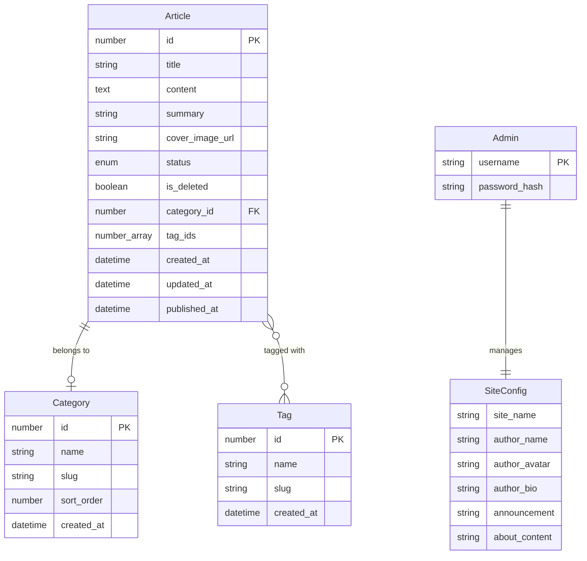

---
AIGC:
  ContentProducer: '001191110102MAD55U9H0F10002'
  ContentPropagator: '001191110102MAD55U9H0F10002'
  Label: '1'
  ProduceID: 'ea2e0aeb-59b1-4594-99b7-1e3ae101c2a0'
  PropagateID: 'ea2e0aeb-59b1-4594-99b7-1e3ae101c2a0'
  ReservedCode1: '84dcf00e-4f9e-4174-8d0c-b88edd1b2fe4'
  ReservedCode2: '84dcf00e-4f9e-4174-8d0c-b88edd1b2fe4'
---

# 阶段3：领域建模 — Blog_Edge

## 1. 实体定义

### 1.1 Article（文章）— 聚合根

| 属性 | 类型 | 约束 | 说明 |
|------|------|------|------|
| id | number | 主键，自增 | 文章唯一标识（从索引生成器分配） |
| title | string | 非空，1-200字 | 标题 |
| content | string | 非空 | 正文（Markdown） |
| summary | string \| null | 最大500字 | 摘要（为空时自动生成） |
| cover_image_url | string \| null | 最大500字 | 封面图 URL |
| status | "draft" \| "published" | 非空，默认 "draft" | 发布状态 |
| is_deleted | boolean | 非空，默认 false | 软删除标记 |
| category_id | number \| null | 外键→Category | 所属分类（删除分类时置 null） |
| tag_ids | number[] | 默认 [] | 关联标签ID数组（替代多对多关联表） |
| created_at | ISO 8601 | 自动生成 | 创建时间 |
| updated_at | ISO 8601 | 自动更新 | 更新时间 |
| published_at | ISO 8601 \| null | 首次发布时写入 | 发布时间 |

### 1.2 Category（分类）

| 属性 | 类型 | 约束 | 说明 |
|------|------|------|------|
| id | number | 主键，自增 | 分类唯一标识 |
| name | string | 非空，唯一，1-100字 | 分类名 |
| slug | string | 非空，唯一，1-100字 | URL友好标识 |
| sort_order | number | 非空，默认0 | 排序值 |
| created_at | ISO 8601 | 自动生成 | 创建时间 |

### 1.3 Tag（标签）

| 属性 | 类型 | 约束 | 说明 |
|------|------|------|------|
| id | number | 主键，自增 | 标签唯一标识 |
| name | string | 非空，唯一，1-100字 | 标签名 |
| slug | string | 非空，唯一，1-100字 | URL友好标识 |
| created_at | ISO 8601 | 自动生成 | 创建时间 |

### 1.4 Admin（管理员）

| 属性 | 类型 | 约束 | 说明 |
|------|------|------|------|
| username | string | 非空，唯一 | 用户名 |
| password_hash | string | 非空 | bcrypt密码哈希 |

### 1.5 SiteConfig（站点配置）— 值对象

| 属性 | 类型 | 默认值 | 说明 |
|------|------|--------|------|
| site_name | string | "My Blog" | 站点名称 |
| author_name | string | "博主" | 作者名 |
| author_avatar | string | "" | 作者头像URL |
| author_bio | string | "" | 作者简介 |
| announcement | string | "" | 站点公告 |
| about_content | string | "" | 关于页Markdown内容 |

## 2. 实体关系图



## 3. 值对象

| 值对象 | 用途 | 结构 |
|--------|------|------|
| CategoryRef | 文章中内嵌的分类引用 | `{id, name, slug}` |
| TagRef | 文章中内嵌的标签引用 | `{id, name, slug}` |
| ArticleRef | 上下篇导航引用 | `{id, title}` |
| ArticleCard | 前台文章列表卡片 | `{id, title, summary, cover_image_url, category?, tags[], published_at}` |
| ArticleDetail | 文章完整详情 | ArticleCard + `{content, status, created_at, updated_at, prev_article?, next_article?}` |
| AdminArticleItem | 后台文章列表项 | `{id, title, status, is_deleted, category?, created_at, updated_at, published_at}` |
| DashboardData | 仪表盘统计数据 | `{article_count, published_count, draft_count, category_count, tag_count, recent_articles[]}` |
| Pagination | 分页元数据 | `{items[], total, page, size}` |

## 4. 聚合根边界

### Article 聚合根
- **聚合范围**：Article 实体本身 + 内嵌的 tag_ids 数组。Category 和 Tag 是独立聚合根，Article 仅引用其 ID。
- **不变量**：
  - `status` 为 "published" 时 `published_at` 不为 null（首次发布时写入）
  - `is_deleted = true` 的文章不出现在前台查询结果中
  - `summary` 为空时由 `content` 自动生成（正则去Markdown语法取前200字）
  - `published_at` 一旦写入不再更新（即使 draft→published→draft→published）

### Category 聚合根
- **聚合范围**：Category 实体本身
- **不变量**：
  - `name` 和 `slug` 全局唯一
  - 删除 Category 时，引用它的 Article 的 `category_id` 置为 null

### Tag 聚合根
- **聚合范围**：Tag 实体本身
- **不变量**：
  - `name` 和 `slug` 全局唯一
  - 删除 Tag 时，引用它的 Article 的 `tag_ids` 数组中移除该 ID

## 5. 业务规则

| 编号 | 规则 | 说明 |
|------|------|------|
| BR-1 | 摘要自动生成 | `summary` 为空时，从 `content` 中去除Markdown语法后取前200字 + "..." |
| BR-2 | 首次发布写时间 | `draft → published` 转换时写入 `published_at`；后续状态切换不更新 |
| BR-3 | 软删除 | 删除文章设置 `is_deleted = true`，不从存储中物理删除 |
| BR-4 | 前台过滤 | 前台查询仅返回 `status = "published" && is_deleted = false` |
| BR-5 | 分类删除级联 | 删除分类时关联文章的 `category_id` 置 null（不阻止删除） |
| BR-6 | 标签删除级联 | 删除标签时从所有文章的 `tag_ids` 中移除该标签ID |
| BR-7 | slug唯一性 | 分类和标签的 `name`、`slug` 在各自范围内全局唯一 |
| BR-8 | 上下篇导航 | 按 `published_at` 排序查找当前文章的前后已发布文章 |
| BR-9 | 归档分组 | 按 `published_at` 的年→月两级分组，年月均倒序 |
| BR-10 | 索引同步 | 文章增删改时同步更新 `index/articles.json` 索引文件 |

## 6. Blob Storage 键值建模

### 6.1 键命名方案

| Blob Key | 建模风格 | 内容 | 读写模式 |
|----------|----------|------|----------|
| `articles/<id>.json` | 一文件一记录 | 完整文章对象（含 tag_ids 数组） | CRUD：get/setJSON/delete + list(prefix) |
| `categories/<id>.json` | 一文件一记录 | 完整分类对象 | CRUD：get/setJSON/delete + list(prefix) |
| `tags/<id>.json` | 一文件一记录 | 完整标签对象 | CRUD：get/setJSON/delete + list(prefix) |
| `index/articles.json` | 单JSON文档 | 文章索引数组：`[{id, title, status, is_deleted, published_at, category_id, tag_ids, created_at, updated_at}]` | 列表/统计/归档/上下篇：一次 get 全量读取 |
| `config/site.json` | 单JSON文档 | 站点配置对象：`{site_name, author_name, ...}` | 一次 get/setJSON |
| `config/about.json` | 单JSON文档 | 关于页内容：`{content}` | 一次 get/setJSON |
| `admin/credentials.json` | 单JSON文档 | 管理员凭证：`{username, password_hash}` | 登录时 get |

### 6.2 ID 生成策略

使用自增计数器，存储在 `index/counters.json` 中：
```json
{
  "article": 0,
  "category": 0,
  "tag": 0
}
```
每次创建新记录时：读取计数器 → +1 → 写回 → 作为新记录 ID。

> **并发考量**：单管理员场景，并发写入极低，read-modify-write 可接受。strong consistency 保证写后可读。

### 6.3 索引文件设计

`index/articles.json` 是性能关键路径，设计为包含列表/统计/归档所需的全部字段，避免逐个读取文章详情：

```json
[
  {
    "id": 1,
    "title": "文章标题",
    "status": "published",
    "is_deleted": false,
    "published_at": "2026-09-07T10:00:00Z",
    "category_id": 1,
    "tag_ids": [1, 2],
    "created_at": "2026-09-07T09:00:00Z",
    "updated_at": "2026-09-07T10:00:00Z"
  }
]
```

支持的操作（全在内存中完成）：
- 列表分页：filter(status=published, is_deleted=false) → sort(published_at DESC) → slice(page, size)
- 分类过滤：filter(category_id === X)
- 标签过滤：filter(tag_ids.includes(X))
- 归档分组：groupBy(year, month)
- 上下篇：findIndex → prev/next
- 统计计数：filter + length
- 后台列表：filter(status?, keyword?, include_deleted?) → sort(created_at DESC) → slice

## 7. 术语表（Glossary）

| 术语 | 定义 |
|------|------|
| 前台 | 面向访客的公开页面和API，无需认证 |
| 后台 | 面向管理员的功能和API，需要JWT认证 |
| 软删除 | 设置 `is_deleted = true` 而非物理删除，后台可查看回收站 |
| 索引文件 | `index/articles.json`，文章元数据的紧凑索引，用于避免全量读取文章详情 |
| CategoryRef | 文章中内嵌的分类引用快照（id/name/slug），避免每次都关联查询 |
| TagRef | 文章中内嵌的标签引用快照（id/name/slug） |
| Blob Store | EdgeOne 平台的对象存储服务，本项目用作数据库 |
| Cloud Function | EdgeOne 平台的Node.js服务端函数，本项目用作后端API |
| Middleware | EdgeOne 平台的边缘中间件，本项目用作JWT认证守卫 |

## 8. 架构决策记录（ADR）

### ADR-001：使用 Blob 单JSON文档存储文章索引

**状态**：已接受

**背景**：Blob Storage 无 SQL 查询能力。文章列表分页、归档分组、分类/标签过滤、统计计数等操作需要遍历文章。如果每次都 `list({prefix: "articles/"})` + 逐个 `get`，几十篇文章会产生几十次 Blob 读取，冷启动下延迟显著。

**决策**：维护一个 `index/articles.json` 索引文件，包含所有文章的元数据（不含正文 content）。一次 `get` 全量读取后在内存中完成所有查询/排序/分页。文章增删改时同步更新索引文件。

**替代方案**：
- A) 每次全量遍历文章文件 → 延迟太高（N次Blob读取）
- B) 按分类/标签/年月建多个索引 → 复杂度高，维护负担大，数据量小不值得
- C) 用 KV Storage 存索引 → KV 仅 Edge Functions 可用，Cloud Functions 无法访问

**后果**：
- 正面：一次 Blob 读取完成所有列表/统计/归档查询，性能好
- 负面：索引文件是 read-modify-write，并发写入有竞争风险（但单管理员场景可接受）
- 负面：索引与文章数据有一致性风险（需在同一个操作中更新两者）

### ADR-002：用 tag_ids 数组替代多对多关联表

**状态**：已接受

**背景**：原项目用 `article_tags` 关联表实现文章-标签多对多关系。Blob Storage 无 JOIN 能力，关联表模式需要多次读取才能获取文章的标签。

**决策**：在文章 JSON 中直接内嵌 `tag_ids: number[]` 数组。需要标签详情时，通过索引文件或标签列表查找。

**后果**：
- 正面：文章的标签关联一次读取即可获得，无额外 Blob 查询
- 正面：删除标签时遍历文章更新 tag_ids 直观
- 负面：标签信息（name/slug）需要额外查询标签文件获取（前台返回时需关联填充 CategoryRef/TagRef）

### ADR-003：分类/标签用单JSON文档而非一文件一记录

**状态**：已否决 — 改用一文件一记录

**背景**：分类和标签数据量极小（通常几个到几十个），可考虑用单个 JSON 文件存储全部分类/标签。

**决策**：仍然采用一文件一记录模式（`categories/<id>.json`、`tags/<id>.json`），与文章保持一致。同时维护一个 `index/categories.json` 和 `index/tags.json` 索引文件用于列表查询。

**理由**：一致性优于"优化"；CRUD 操作语义清晰；读取单条记录用 get(key)，列表查询用索引文件，逻辑统一。

> 更正：为简化实现，分类和标签的数量极少（通常 <20），直接 `list({prefix: "categories/"})` + 逐个 `get` 的开销可忽略，不需要额外索引文件。仅文章需要索引文件（因为文章数量可能达几百篇，且正文 content 体积大，全量读取不划算）。